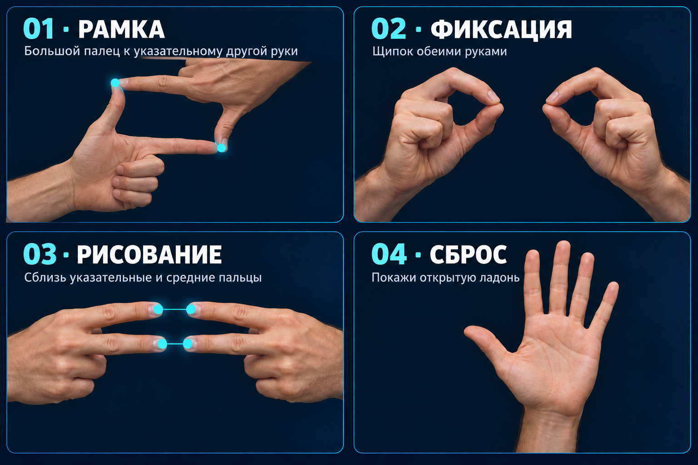

# Hand Motion

Управление эффектами веб-камеры жестами рук: glitch-прямоугольник,
фиксация области и рисование светящихся фигур пальцем.

Учебный проект на Python, OpenCV и MediaPipe. Распознавание рук использует
готовые модели MediaPipe; логика взаимодействия, геометрия областей и визуальные
эффекты реализованы в приложении. Обучать модель или скачивать датасет не нужно.

## Запуск на Windows

Нужны веб-камера и Python **3.11 или 3.12 (64-bit)**. Проверено в отдельном
окружении Python 3.12; более новые версии Python пока не поддерживаются этой
конфигурацией зависимостей.

Открой PowerShell в папке проекта. Следующие команды рассчитаны на новую
папку `.venv`. Если она уже есть после другой версии Python, сначала
переименуй её: `Rename-Item .venv .venv-backup` (выбери свободное имя).
Создание окружения поверх старого не удаляет несовместимые пакеты.

```powershell
py -3.12 -m venv .venv
.\.venv\Scripts\python.exe -m pip install -r requirements.txt
.\.venv\Scripts\python.exe download_model.py
.\.venv\Scripts\python.exe main.py
```

Для Python 3.11 замени `-3.12` на `-3.11`. Если существующее окружение пишет
`No Python at ...`, переименуй старую папку `.venv` и создай новую.
Активация окружения не нужна: команды используют его Python напрямую.

При нескольких камерах: `main.py --camera 1`. Путь к другой модели:
`main.py --model path/to/model.task`. Справка: `main.py --help`.

## Ошибка импорта MediaPipe

Если появляется `No module named 'mediapipe.python._framework_bindings'`,
в окружении могут остаться бинарные файлы от другой версии Python.
Например, файл `cp311-win_amd64.pyd` не загрузится в Python 3.12.

Закрой приложение и терминалы, использующие окружение. В новом PowerShell
из папки проекта пересоздай окружение, сохранив старое:

```powershell
Rename-Item .venv .venv-backup
py -3.12 -m venv .venv
.\.venv\Scripts\python.exe -m pip install -r requirements.txt
.\.venv\Scripts\python.exe -c "import mediapipe as mp; print(mp.__version__)"
.\.venv\Scripts\python.exe main.py
```

Если `.venv-backup` уже существует, используй другое имя резервной папки.
Для виртуальной камеры установи `requirements-virtual.txt` вместо
`requirements.txt`. Не копируй `site-packages` из старого окружения.

## Управление



*Иллюстрации созданы с помощью ИИ и показывают положения рук; это не снимки
работы распознавателя. Расстояния на картинке условные.*

Для рамки сблизь большой палец каждой руки с указательным пальцем другой.
Щипок обеими руками переключает фиксацию уже созданной области.
В жесте рисования сближай указательный с указательным, средний со средним.
Затем подожди 0.8 секунды и правым указательным пальцем обведи замкнутую
фигуру. Открытая ладонь сбрасывает эффекты.

| Действие | Результат |
| --- | --- |
| Сложить рамку большими и указательными пальцами двух рук | Включить прямоугольную область с glitch-эффектом |
| Соединить большой и указательный пальцы на каждой руке | Зафиксировать / отпустить область |
| Сблизить указательные пальцы двух рук и средние пальцы двух рук | Начать режим рисования после паузы 0.8 секунды |
| Провести правым указательным пальцем замкнутый контур | Создать светящуюся геометрическую фигуру |
| Показать открытую ладонь или нажать `R` | Сбросить эффекты |
| Нажать `Esc` в окне приложения | Выйти |

Изображение зеркальное. Держи обе руки в кадре, обеспечь хорошее освещение.
Пороги расстояний заданы в пикселях, поэтому чувствительность зависит от
разрешения камеры и расстояния до неё. Рисование и распознавание жестов
экспериментальные: возможны ложные срабатывания. Эффект содержит резкие вспышки.

Кадры обрабатываются локально; приложение не записывает и не отправляет видео.

## Виртуальная камера (дополнительно)

```powershell
.\.venv\Scripts\python.exe -m pip install -r requirements-virtual.txt
.\.venv\Scripts\python.exe virtual_camera.py
```

На Windows нужен установленный [OBS Studio](https://obsproject.com/) с компонентом
виртуальной камеры. В приложении для звонков выбери `OBS Virtual Camera`.
Не запускай вывод виртуальной камеры одновременно из OBS и этого скрипта.
Подробности установки backend: [pyvirtualcam](https://github.com/letmaik/pyvirtualcam).

Это ранний отдельный режим: рамка, фиксация, волновой эффект; рисования замкнутых
неоновых фигур из `main.py` в нём пока нет. По умолчанию есть окно предпросмотра
с `R` / `Esc`. Для работы без окна используй `--no-preview`, выход — `Ctrl+C`.

## Устройство проекта

- `main.py` — жесты, геометрия, эффекты и окно камеры.
- `virtual_camera.py` — экспериментальный вывод через pyvirtualcam.
- `runtime.py` — запуск и освобождение камеры и моделей.
- `download_model.py` — загрузка официальной модели с проверкой SHA-256.
- `tests/` — проверки без физической камеры.

MediaPipe закреплён на версии 0.10.14, поскольку код использует `mp.solutions`.
Устанавливай зависимости в отдельное окружение. Дополнительный пакет
`opencv-python` не нужен: `opencv-contrib-python` уже предоставляет `cv2`.

## Проверка и упаковка

```powershell
.\.venv\Scripts\python.exe -m unittest discover -s tests -v
.\.venv\Scripts\python.exe build_release.py
```

Архив `dist/hand-motion-source.zip` собирается по явному списку файлов:
датасеты, окружения, скриншоты, записи и веса туда не попадают.
Модель скачивается отдельно. Для полной проверки перед публикацией нужно
пройти управление с настоящей камерой и проверить виртуальную камеру с OBS.

## Источники

[MediaPipe Gesture Recognizer](https://ai.google.dev/edge/mediapipe/solutions/vision/gesture_recognizer)
и [модель Google, float16, версия 1](https://storage.googleapis.com/mediapipe-models/gesture_recognizer/gesture_recognizer/float16/1/gesture_recognizer.task).
Локальный файл модели сверён с официальным по SHA-256.
Собственная модель в рамках этого приложения не обучалась.

Лицензия на исходный код проекта пока не выбрана. Лицензии сторонних библиотек
и условия распространения модели определяются их авторами.
